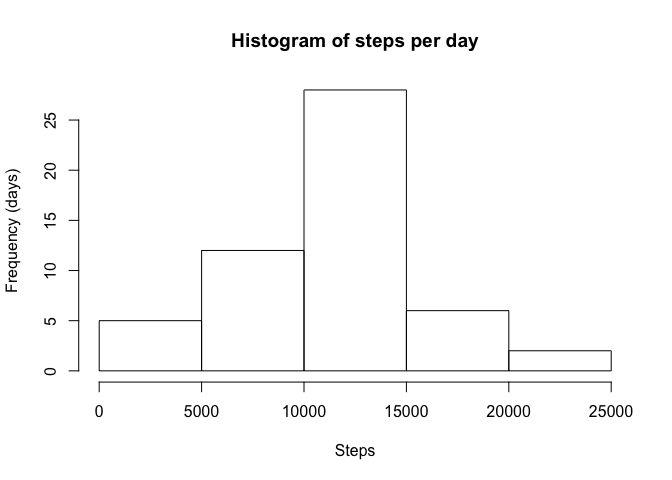
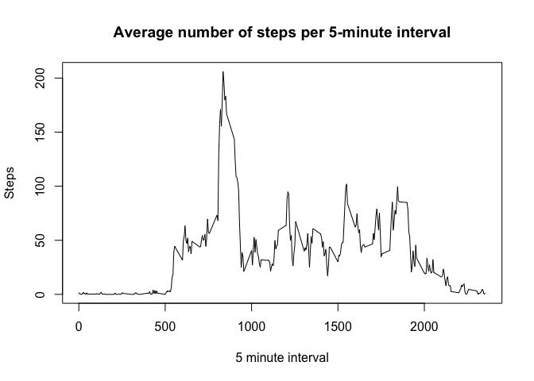
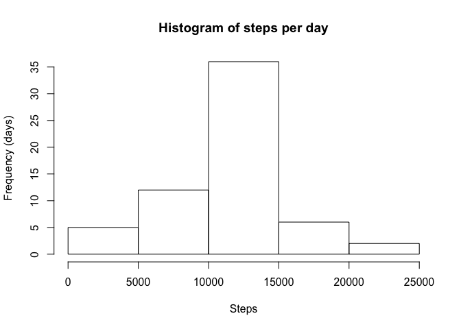

```r
library(knitr)
library(lattice)
library(plyr)
library(chron)
```

```
## NOTE: The default cutoff when expanding a 2-digit year
## to a 4-digit year will change from 30 to 69 by Aug 2020
## (as for Date and POSIXct in base R.)
```

```r
knitr::opts_chunk$set(echo = TRUE)
knitr::opts_chunk$set(fig.path = "./figure/")
```

## Loading and preprocessing the data


```r
fileURL <- "https://d396qusza40orc.cloudfront.net/repdata%2Fdata%2Factivity.zip"
destfile = "data.zip"
if(!file.exists(destfile)){
  download.file(fileURL, destfile, method = "curl")
}

if(!paste("activity.csv") %in% dir()){
  unzip("data.zip")
}

activityDf <- read.csv("activity.csv")

activityDf$date <- as.Date(activityDf$date)
```

## What is mean total number of steps taken per day?
Calculate total number of steps per day and make a histogram. 


```r
stepsPerDayDf <- aggregate(steps ~ date, activityDf, sum)

hist(stepsPerDayDf$steps, main = "Histogram of steps per day", xlab ="Steps", ylab ="Frequency (days)")
```

<!-- -->

Calculate and report the mean and median of the total number of steps taken per day.

Mean: 

```r
mean(stepsPerDayDf$steps)
```

```
## [1] 10766.19
```

Median:

```r
median(stepsPerDayDf$steps)
```

```
## [1] 10765
```

## What is the average daily activity pattern?
Make a time series plot (i.e. \color{red}{\verb|type = "l"|}type = "l") of the 5-minute interval (x-axis) and the average number of steps taken, averaged across all days (y-axis)


```r
stepsPerIntervalDf <- aggregate(steps ~ interval, activityDf, mean, na.rm = TRUE) 
with(stepsPerIntervalDf, plot(interval, steps, type="l", main ="Average number of steps per 5-minute interval", ylab="Steps", xlab ="5 minute interval"))
```

<!-- -->

The 5-minute interval that, on average, contains the maximum number of steps:

```r
stepsPerIntervalDf[which.max(stepsPerIntervalDf$steps),]$interval
```

```
## [1] 835
```

## Imputing missing values
Number of rows with missing values:

```r
sum(!complete.cases(activityDf))
```

```
## [1] 2304
```

New dataset imputing with the mean of the interval concerned.


```r
impute <- function(x, fun) {
  missing <- is.na(x)
  replace(x, missing, fun(x[!missing]))
}


imputedActivityDf <- ddply(activityDf, ~ interval, transform, steps = impute(steps, mean))
```

Histogram of the total number of steps taken each day after missing values are imputed

```r
imputedStepsPerDayDf <- aggregate(steps ~ date, imputedActivityDf, sum)

hist(imputedStepsPerDayDf$steps, main = "Histogram of steps per day", xlab ="Steps", ylab ="Frequency (days)")
```

<!-- -->

Mean

```r
mean(imputedStepsPerDayDf$steps)
```

```
## [1] 10766.19
```

Median

```r
median(imputedStepsPerDayDf$steps)
```

```
## [1] 10766.19
```

Difference between the mean / median of the imputed data and the orignal: 

```r
mean(imputedStepsPerDayDf$steps) - mean(stepsPerDayDf$steps)
```

```
## [1] 0
```

```r
median(imputedStepsPerDayDf$steps) - median(stepsPerDayDf$steps)
```

```
## [1] 1.188679
```

Imputing does not affect the mean, as NAs are ignored. It does however affect the median as more numbers are added.

## Are there differences in activity patterns between weekdays and weekends?
Yes, weekdays have a clearer peak in the mornings and a lower activity level during the day, compared to the weekends, which have a later start and more activity during the day. 


```r
imputedActivityDf$day <- cbind(factor(imputedActivityDf$day, levels = c("weekend", "weekday")), ifelse(is.weekend(imputedActivityDf$date), "weekend", "weekday"))
```


```r
imputedStepsPerDayDf <- aggregate(steps ~ interval+day, imputedActivityDf, mean)
xyplot(steps ~ interval | day, data = imputedStepsPerDayDf, type = "l", layout = c(1,2))
```

<!-- -->
